# 第1关：基本测试

根据S-DES算法编写和调试程序，提供GUI解密支持用户交互。输入可以是8bit的数据和10bit的密钥，输出是8bit的密文。

## 1. 1 加密算法测试结果

| **明文** |  **密钥**  | **密文** |
| :------: | :--------: | :------: |
| 11111111 | 1111111111 | 11001011 |
| 00000000 | 1111111111 | 01110011 |
| 11111111 | 0000000000 | 10001100 |
| 00000000 | 0000000000 | 00110100 |
| 10101010 | 1010101010 | 01111010 |

## 1.2 解密算法的测试结果

| **密文** |  **密钥**  | **明文** |
| :------: | :--------: | :------: |
| 11001011 | 1111111111 | 11111111 |
| 01110011 | 1111111111 | 00000000 |
| 10001100 | 0000000000 | 11111111 |
| 00110100 | 0000000000 | 00000000 |
| 01111010 | 1010101010 | 10101010 |

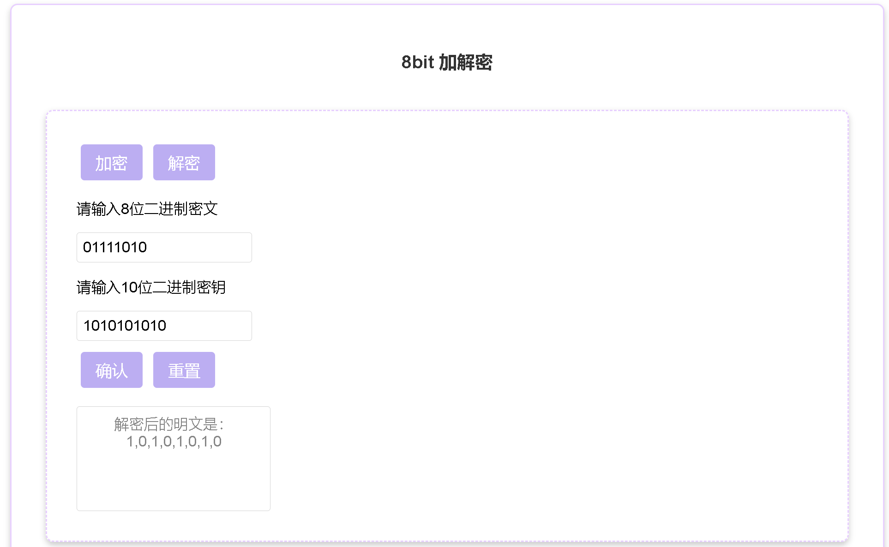

# 第2关：交叉测试

# 第3关：扩展功能

## 3.1 ASII加解密

考虑到向实用性扩展，加密算法的数据输入可以是ASII编码字符串(分组为1 Byte)，对应地输出也可以是ACII字符串(很可能是乱码)。

### 3.1.1 加密算法测试结果

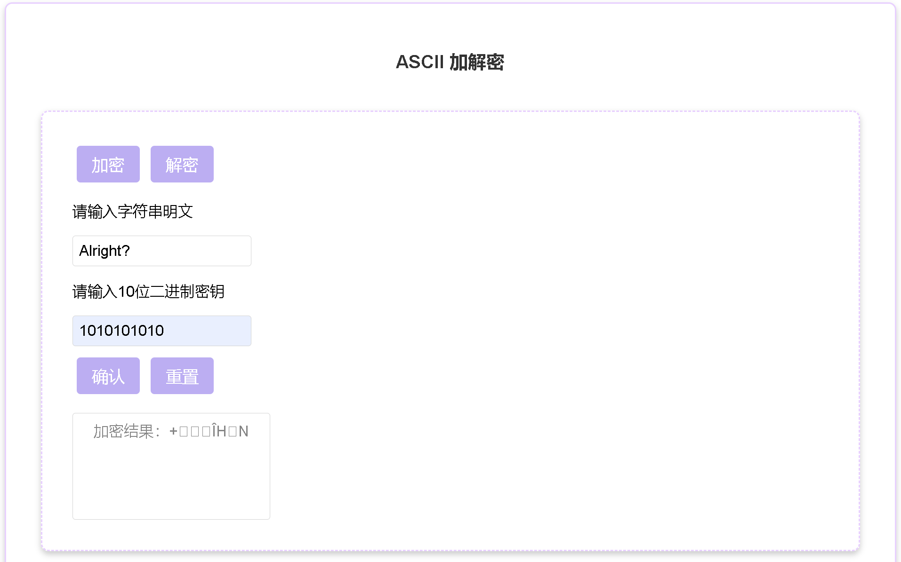

### 3.1.2 解密算法测试结果

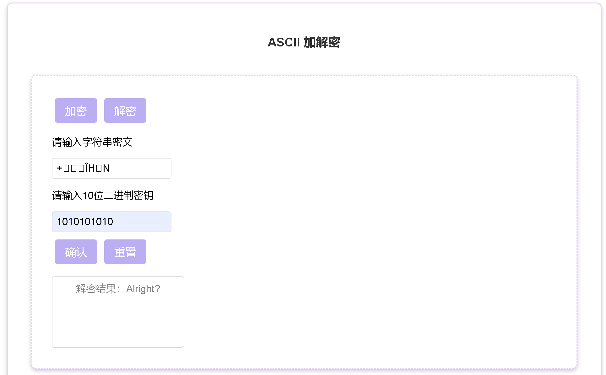

## 3.2 文件加密

### 3.2.1 加密算法测试结果

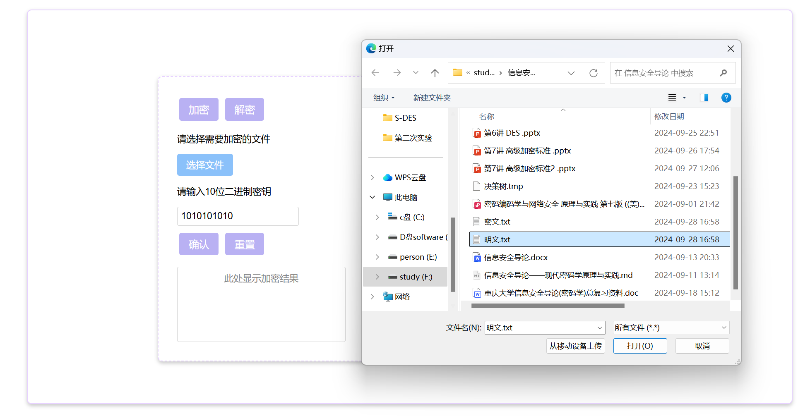

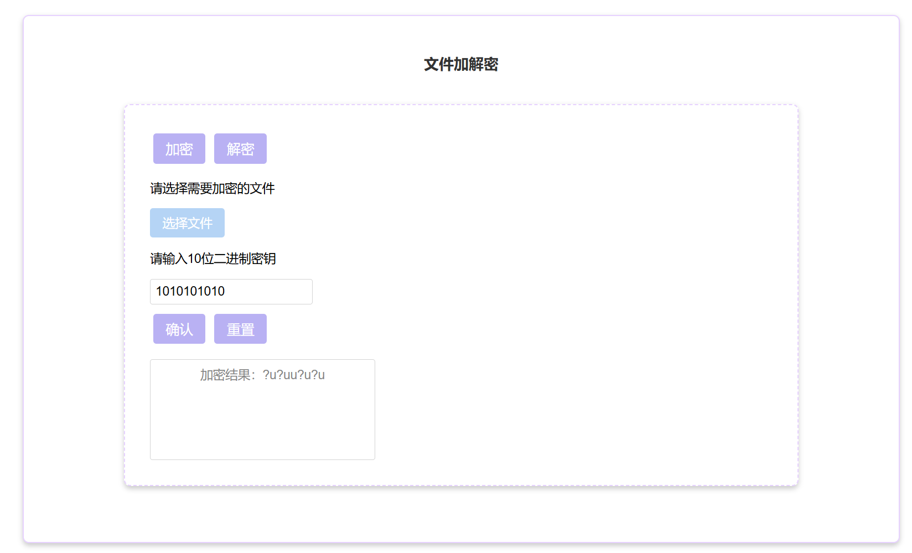

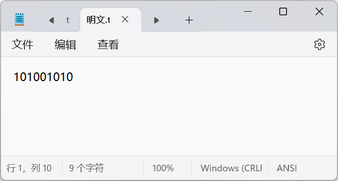

### 3.2.2 解密算法测试结果

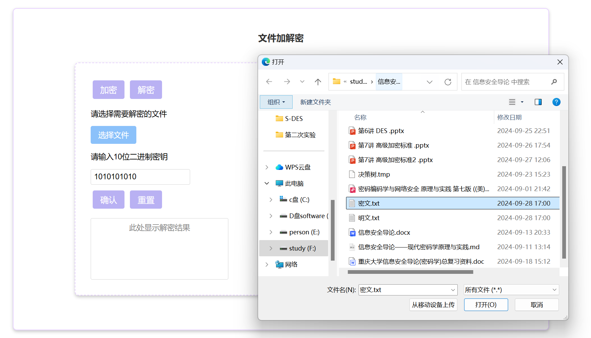

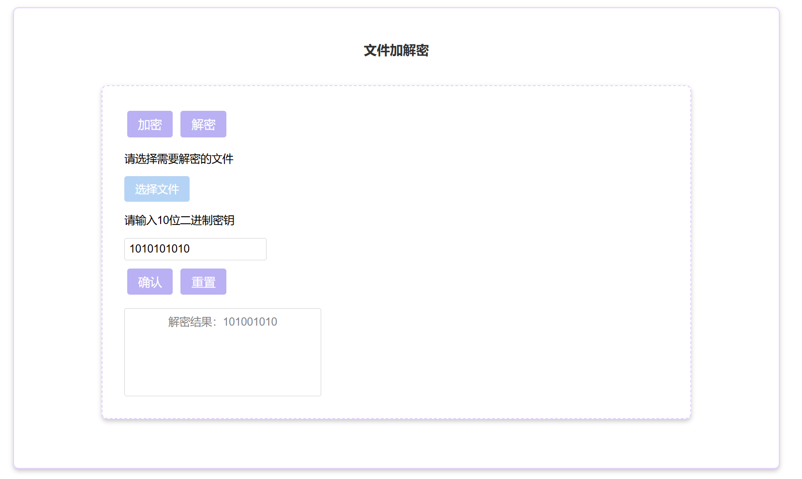

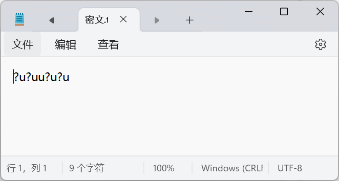

# 第4关：暴力破解

假设你找到了使用相同密钥的明、密文对(一个或多个)，请尝试使用暴力破解的方法找到正确的密钥Key。在编写程序时，你也可以考虑使用多线程的方式提升破解的效率。请设定时间戳，用视频或动图展示你在多长时间内完成了暴力破解。

破解明密文对11111111-11001011，结果如下：

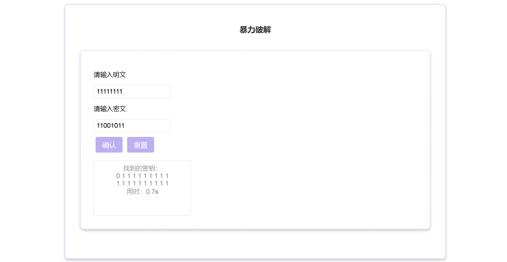

# 第5关：封闭测试

根据第4关的结果，进一步分析，对于你随机选择的一个明密文对，是不是有不止一个密钥Key？进一步扩展，对应明文空间任意给定的明文分组Pn，是否会出现选择不同的密 Ki ≠ Kj 加密得到相同密文 Cn 的情况？

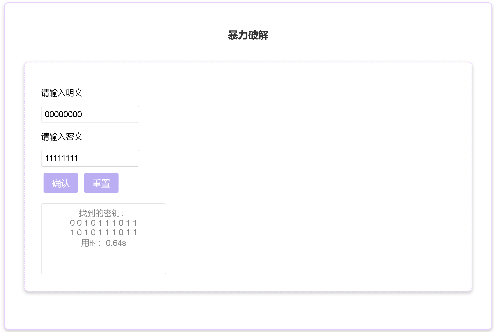

随机选取明密文对，找到的密钥有多个。
